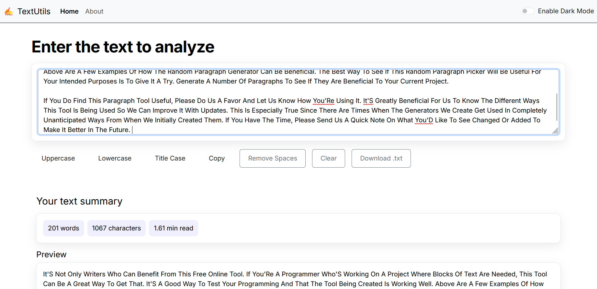

# TextUtils

Beginner-friendly text utility app to manipulate and analyze text.



## Features

- Uppercase, Lowercase, Title Case
- Remove Extra Spaces
- Copy to clipboard, Download as .txt
- Word/character count, estimated read time
- Light/Dark mode

## Quick Start

```bash
npm install
npm start
```

Open `http://localhost:3000`.

## Build

```bash
npm run build
```

## Deploy (GitHub Pages)

```bash
npm run deploy
```
